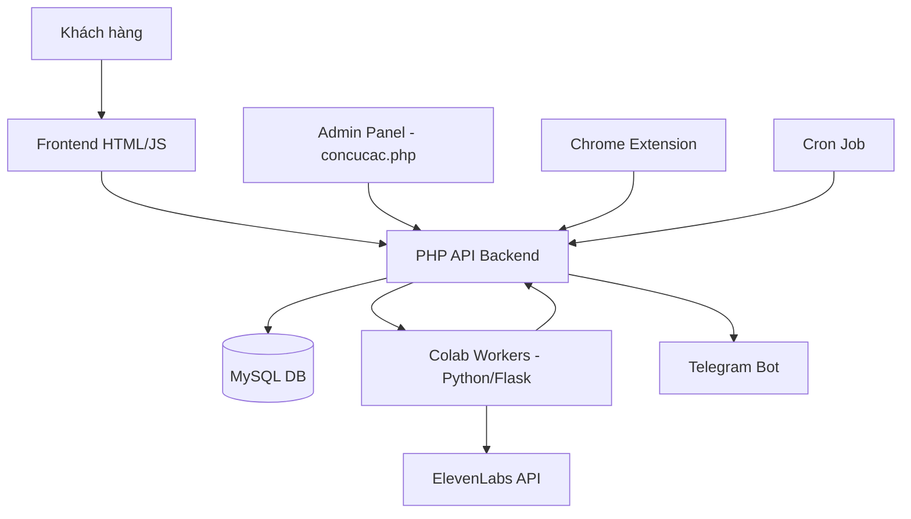
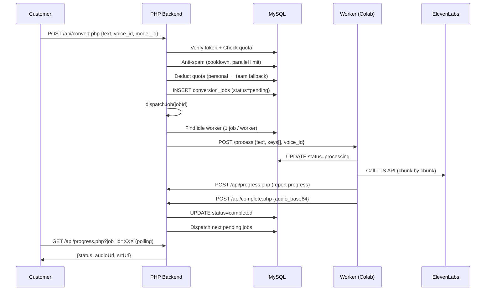

# 🏗️ Kiến trúc hệ thống 11labs.id.vn

> Tài liệu bảo trì cho toàn bộ hệ thống. Cập nhật: 2026-03-26.

---

## 1. Tổng quan

Hệ thống SaaS cung cấp dịch vụ AI Audio (TTS, Music, Isolator, SFX, STT, Dubbing, Conversation) chạy trên **PHP + MySQL** (shared hosting), với **Google Colab workers** xử lý qua ElevenLabs API.



### Stack
| Layer | Công nghệ |
|-------|-----------|
| Frontend | HTML + Vanilla JS (SPA-like, mỗi feature 1 file .html) |
| Backend | PHP 8.x, MySQL (PDO) |
| Worker | Python Flask trên Google Colab |
| Tunnel | Ngrok (free tier, token pool) |
| Admin | `concucac.php` (PHP + JS, ~4200 dòng) |
| Remote Control | Chrome Extension (Manifest V3) |
| Alerts | Telegram Bot API |
| Auth | JWT tự viết + Google OAuth |

---

## 2. Cấu trúc thư mục

```
colabs/
├── index.html              # Landing page
├── login.html              # Đăng nhập/Đăng ký
├── customer.html           # Trang TTS chính (khách)
├── conversation.html       # Hội thoại đa giọng
├── music.html              # Tạo nhạc AI
├── isolator.html           # Tách giọng
├── sound-effect.html       # Hiệu ứng âm thanh
├── speech-to-text.html     # Giọng → Chữ
├── dubbing.html            # Lồng tiếng
├── voice_changer.html      # Đổi giọng
├── profile.html            # Hồ sơ cá nhân + Team
├── affiliate.html          # Tiếp thị liên kết
├── api-docs.html           # Tài liệu API cho developer
├── concucac.php            # 🔑 ADMIN PANEL (toàn bộ)
├── white-label-tts/        # Hệ thống white-label cho đại lý
│   ├── index.html          # Đăng nhập/Đăng ký (ref code support)
│   ├── app.html            # Giao diện TTS white-label
│   ├── affiliate.html      # Trang giới thiệu bạn bè
│   ├── quocprovgy147.php   # Admin white-label
│   ├── data/database.sqlite # SQLite DB
│   ├── data/settings.json  # Cài đặt site (JSON)
│   └── api/                # Backend API (PHP + SQLite)
│       ├── config.php      # Config + helpers + sendTelegramNotify()
│       ├── init_db.php     # Migration (customers, plans, orders, affiliate)
│       ├── auth.php        # Đăng ký/Đăng nhập + referral code
│       ├── plans.php       # CRUD gói + purchase + activate + bonus
│       ├── customers.php   # CRUD khách hàng
│       ├── affiliate.php   # Affiliate API (stats, referrals, bonus)
│       ├── settings.php    # Settings API (CRUD settings.json)
│       └── get_config.php  # Public config cho frontend
├── api/
│   ├── config.php          # 🔑 CẤU HÌNH + dispatchJob() + helpers
│   ├── login.php           # Đăng nhập
│   ├── register.php        # Đăng ký
│   ├── convert.php         # 🔑 Submit TTS job
│   ├── conversation.php    # Submit Conversation job
│   ├── batch_convert.php   # Submit batch TTS
│   ├── progress.php        # 🔑 Worker poll + report progress
│   ├── complete.php        # Worker complete TTS job
│   ├── dispatcher.php      # 🔑 Cron dispatcher
│   ├── cron.php            # 🔑 Cron tổng (cleanup + monitor + dispatch)
│   ├── register_worker.php # Worker đăng ký
│   ├── get_ngrok_token.php # Cấp Ngrok token cho worker
│   ├── worker_command.php  # Chrome Extension ↔ Admin commands
│   ├── telegram.php        # Telegram alerts + auto-restart
│   ├── voices.php          # Voice list API
│   ├── verify_token.php    # JWT verify
│   ├── music/              # Module Music (compose, progress, list, upload_result)
│   ├── sfx/                # Module SFX (compose, progress, list)
│   ├── isolator/           # Module Isolator (upload, progress, list)
│   ├── stt/                # Module STT (upload, progress, list)
│   ├── dubbing/            # Module Dubbing (compose, progress, list)
│   ├── team/manager.php    # Team management
│   ├── admin/              # 🔑 35 admin endpoints
│   ├── worker/app.py       # 🔑 Worker Flask app (chạy trên Colab)
│   ├── external/v1/        # Public REST API (cho developer)
│   └── results/            # Audio output (auto-cleanup)
```

---

## 3. Luồng xử lý Job (TTS - Chủ đạo)

Đây là luồng quan trọng nhất, các module khác (Music, SFX, Isolator, STT, Dubbing) hoạt động tương tự.



### 3.1 Submit Job (`convert.php`)

1. **Verify token** → lấy `user_id`
2. **Anti-spam** (3 tầng, có custom `max_parallel`):
   - Cooldown giữa 2 request (plan-based: trial=10s, pro=5s, vip=3s)
   - Max processing jobs (plan-based hoặc custom `max_parallel`)
   - Max pending jobs
3. **Quota check** (additive: personal + team quota)
4. **Deduct quota** (ưu tiên cá nhân, thiếu lấy team)
5. **Insert job** → status `pending`
6. **Call `dispatchJob()`** ngay lập tức

### 3.2 Dispatch (`config.php::dispatchJob()`)

1. **Load job** + check attempts (max 3)
2. **Parallel limit** (custom `max_parallel` > plan default > 1):
   ```
   $maxProcessing = $customMaxParallel ?: $planProcessingLimits[$plan] ?: 1;
   ```
3. **Resume support** (nếu job bị gián đoạn, gửi text còn lại)
4. **Find idle worker**:
   - Active, last_seen < 180s, không có job đang chạy
   - Ưu tiên worker ít được gán gần nhất (`last_assigned ASC`)
5. **API Key assignment** (Sticky, 12 keys/worker):
   - Ưu tiên keys đã gán cho worker
   - Kéo thêm từ pool nếu < 12 keys
   - Lọc bỏ `sk_` keys (chỉ dùng cho SFX/STT)
6. **Gửi job** tới worker qua HTTP POST

### 3.3 Worker Processing (`worker/app.py`)

- **Flask app** chạy trên Colab, 1 job/thời điểm (Semaphore)
- Heartbeat mỗi 30s → `register_worker.php`
- Nhận job → chunk text (max 4500 ký tự) → call ElevenLabs API (timeout 60s)
- Mỗi chunk: pick key → decrypt → login Firebase → call TTS → concat audio
- Sau mỗi chunk: report progress → `progress.php`
- Hoàn thành: gửi audio base64 → `complete.php`

#### Error Recovery
| Lỗi | Hành xử | Chi tiết |
|-----|---------|----------|
| **Timeout** (1-2 lần) | Retry cùng key, chờ 10s | Per-key counter |
| **Timeout** (3 lần tổng) | Release job → `os._exit(1)` | Gửi partial audio + Telegram alert, worker tự restart |
| **401** (2 key liên tiếp) | Release job → shutdown | IP bị chặn, gửi Telegram + restart |
| **quota_exceeded** | Đổi key tiếp theo | Không đếm vào timeout |
| **Hết key** | Release job + partial audio | Worker khác nhặt tiếp |

#### Ghép nối chunk theo Model

| | V2 (non-V3) | V3 — Tất cả ngôn ngữ |
|--|-------------|----------------------|
| Kỹ thuật | `previous_text` param | **Overlap & Trim** |
| API calls/chunk | 1 | **2** (overlap + combined) |
| Liền mạch | ✅ API tự xử lý | ✅ Overlap 15 từ cuối |

**V3 Overlap & Trim** (cho tất cả ngôn ngữ, đảm bảo giọng đồng nhất):
1. Lấy **15 từ cuối** chunk trước → `smart_overlap`
2. Gọi TTS riêng cho overlap → đo `overlap_duration_ms`
3. Gọi TTS cho `"overlap + chunk hiện tại"` → `combined_audio`
4. Cắt bỏ phần overlap: `combined_audio[overlap_duration_ms + 500ms:]`

#### Chunk Size & Timeout (cập nhật 24/03/2026)

| Model | Ngôn ngữ | Chunk size | Timeout | Overlap |
|-------|----------|-----------|---------|---------|
| V3 | Tiếng Việt/Tonal | **4500** | 150s | ✅ 2 calls |
| V3 | EN, PL, FR... | **3000** | 150s | ✅ 2 calls |
| V2/Turbo/Flash | Tất cả | **4500** | 150s | ❌ 1 call |

#### Timeout Error Recovery (cập nhật 22/03/2026)

- Timeout lần 1 → **retry cùng key** (chờ 10s)
- Timeout lần 2 (tổng) → **release job** + **`os._exit(1)`** (worker restart)
- PHP cooldown worker **5 phút** khi nhận `release_job` → tránh vòng lặp

#### ⚠️ Theo dõi: V3 Timeout (24/03/2026)

> **Vấn đề**: V3 ElevenLabs xử lý chậm hơn trước, gây timeout cho chunk lớn.
> - Tiếng Việt 4500 chars + overlap: cần theo dõi thêm, **cân nhắc giảm xuống 3500-4000** nếu timeout nhiều
> - Non-tonal đã giảm 3000, cần xem kết quả
> - Nguyên nhân có thể: ElevenLabs V3 server chậm đi, hoặc lượng user tăng
> - Trước 19/03 timeout ít hơn, sau đó tăng dần

**Detect ngôn ngữ thanh điệu** (`is_tonal_language()`): kiểm tra ký tự Unicode trong text:
- 🇻🇳 Tiếng Việt (dấu thanh điệu: ắ, ằ, ấ, ầ, ế, ề, ố, ồ...)
- 🇨🇳🇯🇵 Tiếng Trung / Nhật (CJK: U+4E00–U+9FFF)
- 🇯🇵 Tiếng Nhật — Hiragana (U+3040–U+309F) + Katakana (U+30A0–U+30FF)
- 🇹🇭 Tiếng Thái (U+0E00–U+0E7F)
- 🇱🇦 Tiếng Lào (U+0E80–U+0EFF)
- 🇲🇲 Tiếng Myanmar (U+1000–U+109F)
- Ngưỡng: >15% ký tự thuộc nhóm trên → dùng chunk 4500

**Ghép cuối cùng** (mọi model): `segment₁ + 300ms silence + segment₂ + ... → export MP3 64kbps`

### 3.4 Progress Reporting (`progress.php`)

- **GET**: Customer polling (trả status, audio URL nếu completed)
- **POST**: Worker report (update processed_chunks, handle errors)
- Xử lý: `release_job`, `update_progress`, `report_error`
- Error handling: IP block → cooldown worker, key depleted → rotate

### 3.5 Job Completion (`complete.php`)

1. Lưu audio file → `api/results/{jobId}.mp3`
2. Lưu SRT (nếu có) → `api/results/{jobId}.srt`
3. UPDATE status = completed
4. **Trigger next**: tìm 5 pending jobs của user đó → `dispatchJob()`

---

## 4. Các sản phẩm (Modules)

| Module | Submit | Progress | DB Table | Job Prefix | Tính phí |
|--------|--------|----------|----------|------------|----------|
| **TTS** | `convert.php` | `progress.php` | `conversion_jobs` | 8 chars random | 1 char = 1 credit |
| **Conversation** | `conversation.php` | `progress.php` | `conversion_jobs` | `CV-` | 1 char = 1 credit |
| **Batch TTS** | `batch_convert.php` | `progress.php` | `conversion_jobs` | 8 chars random | 1 char = 1 credit, auto-split |
| **Music** | `music/compose.php` | `music/progress.php` | `music_jobs` | `MU` | 1300 credit/phút |
| **SFX** | `sfx/compose.php` | `sfx/progress.php` | `sfx_jobs` | `SX` | 50 credit/giây |
| **Isolator** | `isolator/upload.php` | `isolator/progress.php` | `isolation_jobs` | 8 hex chars | File upload |
| **STT** | `stt/upload.php` | `stt/progress.php` | `stt_jobs` | `ST` | 180 credit/phút |
| **Dubbing** | `dubbing/compose.php` | `dubbing/progress.php` | `dubbing_jobs` | `DB` | 3200 credit/phút |

> Music, SFX, Isolator, STT, Dubbing: Worker tự poll job pending (khác với TTS được dispatch trực tiếp).

### Dubbing Error Recovery
| Lỗi | Hành xử |
|-----|----------|
| **Credits không đủ** (tổng) | `release` → worker khác nhặt |
| **Tiếng Việt, không key đủ lớn** | `release` → worker khác nhặt |
| **IP blocked** (2 key 401 liên tiếp) | `release` → worker tạm dừng 5 phút |
| **Job treo >15 phút** | Auto-reset về `pending` (trong `get_pending`) |
| **Worker crash** | Auto-timeout 15 phút → reset |
| **Hết key giữa chừng** | `fail` + hoàn điểm |

---

## 5. Cron System (`cron.php`)

Chạy định kỳ (mỗi 30-60 giây qua hosting cron hoặc worker call).

| Bước | Chức năng | Chi tiết |
|------|-----------|----------|
| 0 | **File cleanup** | Voice > 12h, Music/Isolator > 3h → xóa |
| 0.5 | **DB cleanup** | Jobs/logs > 48h → xóa, workers > 48h → xóa |
| 1 | **Worker monitor** | Phát hiện offline → alert Telegram → auto-recover jobs |
| 1.5 | **Ngrok cleanup** | Thu hồi token từ worker offline > 5 phút |
| 1.6 | **API Key cleanup** | Giải phóng key từ worker offline > 5 phút |
| 2 | **Admin checks** | Credit thấp → Telegram cảnh báo, Account hết hạn |
| 3 | **Dispatcher** | Dispatch pending jobs + recovery stuck jobs > 8 phút |
| 4 | **Auto backup** | 03:00 AM → backup DB → gửi Telegram |

---

## 6. Worker & Ngrok Token Management

### 6.1 Đăng ký Worker (`register_worker.php`)
- Worker gửi `{secret, url, worker_uuid, worker_name}`
- Upsert vào bảng `workers`, xóa worker cũ cùng URL

### 6.2 Ngrok Token Pool (`get_ngrok_token.php`)
1. Thu hồi token từ worker chết (> 5 phút)
2. Nếu UUID đã có token → trả lại token cũ
3. Nếu mới → `target_name` matching → cấp token mới từ pool
4. Quản lý trong admin: `api/admin/ngrok_keys.php`

### 6.3 API Key Pool (`config.php::dispatchJob`)
- Sticky assignment: 12 keys/worker, ưu tiên key đã gán
- Tự thu hồi key cạn credit (< 100)
- Lọc bỏ `sk_` keys cho TTS (chỉ dùng cho SFX/STT)
- Khi worker hết key → alert Telegram

---

## 7. Admin Panel (`concucac.php`)

File ~4200 dòng, chứa toàn bộ giao diện + logic admin.

### 7.1 Tabs chính
| Tab | Chức năng |
|-----|-----------|
| Dashboard | Thống kê tổng, doanh thu, biểu đồ |
| Khách hàng | CRUD users, edit quota/plan/max_parallel, API key |
| Gói cước | Quản lý subscription packages |
| Thanh toán | Duyệt/từ chối, MoMo template |
| API Keys | Thêm/xóa ElevenLabs keys, check credit |
| Máy chủ | Worker status, health check |
| Colab Control | Chrome Extension remote control |
| Ngrok Tokens | Quản lý token pool |
| Logs | Error logs, worker events, completed jobs |
| Cài đặt | System settings, Telegram config, 2FA |

### 7.2 Auth
- Login: `adminPassword` → `ADMIN_PASSWORD_HASH` (bcrypt)
- 2FA: TOTP (Google Authenticator)
- Mọi API call admin gửi header `X-Admin-Password`

### 7.3 Edit User Modal Fields
`email, plan, custom_plan_name, quota_total, expires_at, status, partner_api_key, key_type, max_parallel`

---

## 8. Chrome Extension (Colab Remote Control)

**Location**: `C:\Users\train\Downloads\tien ich chrome\Colab Remote`

### 8.1 Files
| File | Chức năng |
|------|-----------|
| `manifest.json` | Manifest V3, permissions: storage, alarms, tabs |
| `background.js` | **V12**: Poll commands via `chrome.alarms` (5s interval) |
| `content.js` | **V11**: Execute Disconnect/Run All trên tab Colab |
| `popup.html/js` | Config Server URL, hiển thị tabs đang mở |

### 8.2 Flow
1. Extension tìm tab `Sv\d+.ipynb` → extract tên worker
2. Poll `worker_command.php?worker=SvX` mỗi 5 giây (via `chrome.alarms`)
3. Nhận command → activate tab → `sendMessage` to content script
4. Content script: click Runtime menu → Disconnect/Run All → confirm dialog
5. Report kết quả về server

### 8.3 Auto-Restart (telegram.php)
- Worker offline → Telegram alert
- Tự schedule: disconnect now + `run_all` sau 5 phút
- Max 3 lần/ngày, skip nếu disconnect thủ công

---

## 9. Authentication & User System

### 9.1 Login
- Email + Password → `password_verify` → JWT token (7 ngày)
- Google OAuth → `api/auth/google/` → auto-register/login

### 9.2 User States
`inactive` → (admin activate) → `active` → (hết hạn) → `expired`

### 9.3 Plans & Parallel Limits
| Plan | Parallel Processing | Pending | Cooldown |
|------|---------------------|---------|----------|
| trial | 1 | 1 | 10s |
| basic | 3 | 2 | 5s |
| pro | 5 | 3 | 5s |
| premium | 8 | 5 | 3s |
| supper_vip | 10 | 7 | 3s |
| **Custom** | `max_parallel` field | — | — |
| **Partner** | Unlimited | — | — |

### 9.4 Team System (`team/manager.php`)
- **Leader** tạo invite code, member gia nhập
- Team **chia sẻ** parallel limit + quota pool
- Member dùng: personal quota trước → team quota fallback
- Leader quản lý: set hạn mức, kick, giải tán

---

## 10. Affiliate System

- Mỗi user có `referral_code` → link `?ref=CODE`
- Khi referred user được **activate** → cả 2 bên nhận bonus
- Bonus = `affiliate_commission_rate` % × plan quota (mặc định 10%)
- Quản lý trong `affiliate.php`, tracking trong `affiliate_bonus_logs`

### 10.1 Revenue Tracking (cập nhật 24/03/2026)

- **Backend** (`api/affiliate.php`): query `payments` JOIN `users` WHERE `referrer_id` = user hiện tại
- Trả thêm `total_revenue` (tổng số tiền) và `revenue_payments[]` (danh sách giao dịch)
- **Frontend** (`affiliate.html`):
  - Stat card thứ 4: **Doanh thu từ giới thiệu** (màu vàng)
  - Bảng: Email (ẩn) | Gói cước | Số tiền | Ngày thanh toán

---

## 11. Telegram Notifications (`telegram.php`)

| Event | Function | Bypass Toggle |
|-------|----------|---------------|
| Đăng ký mới | `notifyNewRegistration()` | ✅ |
| Thanh toán | `notifyPaymentSent()` | ✅ |
| Duyệt TT | `notifyPaymentApproved()` | ✅ |
| Worker offline | `checkOfflineWorkers()` | ❌ (theo toggle) |
| Credit thấp | `checkLowCreditAlert()` | ✅ |
| IP bị chặn | `notifyWorkerBlocked()` | ✅ |
| Worker hết key | `notifyWorkerCapacityExhausted()` | ✅ |
| **Worker timeout** | POST `worker_alert` action (từ Python worker) | ✅ |

---

## 12. Database Tables

### Core
| Table | Mô tả |
|-------|-------|
| `users` | Khách hàng (email, plan, quota, team, max_parallel, partner_api_key) |
| `packages` | Gói cước |
| `payments` | Lịch sử thanh toán |
| `system_config` | Cài đặt hệ thống (key-value) |

### Jobs
| Table | Mô tả |
|-------|-------|
| `conversion_jobs` | TTS + Conversation jobs |
| `music_jobs` | Music generation |
| `sfx_jobs` | Sound effect |
| `isolation_jobs` | Vocal isolation |
| `stt_jobs` | Speech-to-text |
| `dubbing_jobs` | Dubbing/lồng tiếng |
| `usage_logs` | Log sử dụng |

### Worker
| Table | Mô tả |
|-------|-------|
| `workers` | Worker pool (uuid, url, ip, status, last_seen) |
| `api_keys` | ElevenLabs API keys (encrypted, sticky assignment) |
| `ngrok_keys` | Ngrok token pool |
| `worker_logs` | Event logs từ worker |

### Admin
| Table | Mô tả |
|-------|-------|
| `colab_extensions` | Chrome extension heartbeat |
| `colab_commands` | Extension commands queue (pending → executing → completed) |
| `admin_harvests` | Thu hoạch doanh thu |
| `ip_block_logs` | IP block tracking |
| `affiliate_bonus_logs` | Affiliate bonus tracking |

---

## 13. File Retention Policy

| Loại | Thư mục | Thời gian lưu |
|------|---------|---------------|
| Voice (TTS) | `api/results/` | **12 giờ** |
| Music | `api/results/music/` | 3 giờ |
| Isolator | `api/results/isolator/` | 3 giờ |
| DB records | `conversion_jobs`, `usage_logs` | 48 giờ |

---

## 14. Security

| Lớp | Cơ chế |
|-----|--------|
| User auth | JWT token (7 ngày), password bcrypt |
| Admin auth | Bcrypt password + optional TOTP 2FA |
| Worker auth | Shared secret (`WORKER_SECRET`) |
| API keys | AES-256-CBC encrypted, server-side decrypt |
| CORS | Wildcard, mọi origin |
| Rate limit | Plan-based cooldown + parallel limit |
| Deadlock | Retry 3 lần với random delay 50-200ms |

---

## 15. Key Configuration (`config.php`)

```php
DB_HOST, DB_NAME, DB_USER, DB_PASS     // MySQL
JWT_SECRET                               // JWT signing
ADMIN_PASSWORD_HASH                      // Admin login (bcrypt)
WORKER_SECRET                            // Worker authentication
INTERNAL_SECRET                          // AES key decrypt
FIREBASE_API_KEY                         // ElevenLabs login
PHP_BACKEND_URL                          // Self URL (https://11labs.id.vn)
GOOGLE_CLIENT_ID, GOOGLE_CLIENT_SECRET   // Google OAuth
```

---

## 16. Lưu ý bảo trì quan trọng

> [!IMPORTANT]
> **Lazy Schema**: Hầu hết cột mới được thêm bằng `ALTER TABLE ... ADD COLUMN` wrapped trong try-catch. Lần đầu truy cập sẽ tự tạo cột.

> [!WARNING]
> **Chrome Extension**: Phải dùng `chrome.alarms` (không dùng `setInterval`) vì Manifest V3 Service Worker bị Chrome kill sau ~30s idle.

> [!CAUTION]
> **Parallel limit check** tồn tại ở 2 nơi: `convert.php` (submit-time) và `dispatchJob()` (dispatch-time). Custom `max_parallel` hiện chỉ áp dụng ở `dispatchJob()`. Submit-time vẫn dùng plan default.

> [!TIP]
> Khi thêm tính năng mới cho 1 module, check pattern ở module TTS trước (convert → dispatchJob → progress → complete) rồi áp dụng tương tự.

---

## 17. White-Label TTS (Hệ thống đại lý)

Hệ thống riêng cho đại lý, chạy **PHP + SQLite** (không dùng MySQL). Đại lý mua quota từ site chính qua Partner API Key, rồi bán lại cho khách hàng.

### 17.1 Stack
| Layer | Công nghệ |
|-------|-----------|
| Frontend | HTML + JS (index.html, app.html, affiliate.html) |
| Backend | PHP 8.x, **SQLite** (PDO) |
| Admin | `quocprovgy147.php` |
| Config | `data/settings.json` (JSON file, không DB) |
| Auth | Token-based (`auth_token` trong bảng `customers`) |
| Admin auth | Password (bcrypt hash trong settings.json hoặc ADMIN_PASSWORD) |

### 17.2 SQLite Tables
| Table | Mô tả |
|-------|-------|
| `customers` | Khách hàng (email, quota, plan, `referral_code`, `referred_by`) |
| `plans` | Gói dịch vụ (name, quota, price) |
| `orders` | Đơn mua gói (pending → approved/rejected) |
| `plan_activations` | Lịch sử kích hoạt gói |
| `tts_history` | Lịch sử convert |
| `affiliate_bonus_logs` | Bonus từ giới thiệu |

### 17.3 Affiliate System (cập nhật 26/03/2026)

Khách hàng đại lý có thể giới thiệu bạn bè và nhận bonus khi người được giới thiệu mua gói.

| Thành phần | File | Chi tiết |
|-----------|------|----------|
| Đăng ký + ref | `api/auth.php` | `?ref=CODE` → lưu `referred_by` |
| Affiliate API | `api/affiliate.php` | Stats, referrals, bonus, revenue |
| Kích hoạt bonus | `api/plans.php` | `handleActivate()` + `handleApproveOrder()` → `giveAffiliateBonus()` |
| Settings | `api/settings.php` | `affiliate_enabled`, `affiliate_commission_rate` |
| Frontend | `affiliate.html` | Referral link, stats, bảng bonus |
| Admin UI | `quocprovgy147.php` | Toggle bật/tắt + input % hoa hồng |

**Flow**: Đăng ký qua `?ref=CODE` → `referred_by` = referrer ID → Admin duyệt đơn/kích hoạt gói → `giveAffiliateBonus()` → bonus = `quota × rate%` → cộng vào referrer `quota_allocated`

### 17.4 Telegram Notifications (cập nhật 26/03/2026)

| Event | Trigger | Message |
|-------|---------|---------|
| Đơn hàng mới | `plans.php` → `purchase` action | 🛒 Email, gói, giá, quota |

- Config: `telegram_bot_token` + `telegram_chat_id` trong `settings.json`
- Helper: `sendTelegramNotify()` trong `api/config.php`
- Admin UI: Section "Thông báo Telegram" trong Cài đặt Site
